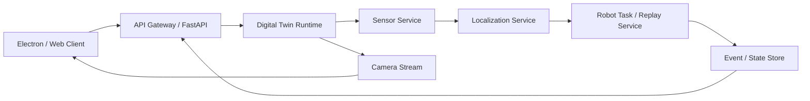
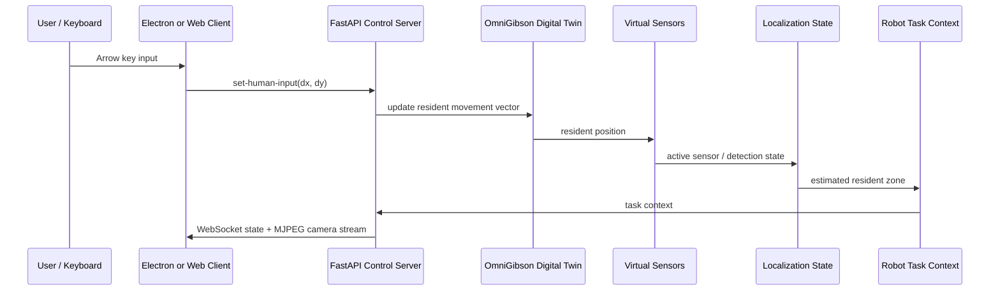

# HomeSense 발표 자료 시각 자료 준비 가이드

작성 기준: `2026-C&S Project_Planning_Team-K ver.260520.pdf`의 4B까지 보완

## 목표

이번 발표 자료는 "AI 모델 학습 완료"보다 "스마트홈 센서 인지 로봇 서비스를 검증하기 위한 디지털 트윈 기반 프로토타입 구현"을 강조하는 것이 안전하다.

현재 구현은 다음을 실제로 보여줄 수 있다.

- OmniGibson / BEHAVIOR `Merom_0_int` 기반 디지털 트윈 로딩
- Electron / Web client 기반 실시간 모니터링
- 방향키 기반 resident 이동
- 가상 모션 센서 및 압력 센서 상태 갱신
- 센서 기반 estimated resident zone / active sensor state 생성
- robot task context에 센서 및 거주자 상태 전달
- top overview / robot / resident camera 전환
- 센서 범위 표시 on/off
- 벽 충돌 및 벽 occlusion 반영

## 슬라이드별 추천 시각 자료

### 1B. X+AI Services Project Overview

필요 자료: MSA 아키텍처 다이어그램

포함 요소:

- Electron / Web Client
- API Gateway / FastAPI Control Server
- Digital Twin Runtime
- Sensor Service
- Localization Service
- Robot Task / Replay Service
- Event Log / State Store
- OmniGibson / BEHAVIOR Dataset

핵심 메시지:

- 현재는 데모 안정성을 위해 단일 런타임에 가깝게 구현했다.
- 논리적으로는 Sensor, Localization, Robot Task, Digital Twin, Client service로 분리 가능한 MSA 구조다.

권장 형태:



### 2C. Project Plan Change & Update

필요 자료: 계획 변경 표

내용:

| Outcome | Planned | Revised | Reason / Result |
|---|---|---|---|
| #1 Dataset / Scene | BEHAVIOR 전체 데이터셋 및 다수 scene 확보 | `Merom_0_int` scene subset만 확보 | 전체 데이터셋은 TB 단위로 과도하므로 필요한 scene/object subset만 이전 |
| #2 Robot / Replay | 실제 R1 replay 및 학습 모델 통합 | R1Pro asset + dummy resident + rule-based sensor demo 안정화 | 협업자 replay 수집 전까지 센서-위치-task context pipeline 검증 |

### 3A. Project Design Validation

필요 자료: 실제 디지털 트윈 화면 캡처 + 라벨링

캡처 항목:

- top overview에서 집 전체가 보이는 화면
- R1Pro robot 위치
- resident 위치
- 주요 센서 위치
- doorless scene 적용 상태

라벨:

- Digital Twin Space: `Merom_0_int_no_interior_doors`
- Device: R1Pro robot, resident avatar
- Virtual Sensors: motion sensors, pressure sensor
- AI System: sensor-aware task context generation

### 3B. Project Design Validation: Data Flow

필요 자료: 데이터 흐름 다이어그램

권장 흐름:



핵심 메시지:

- 사용자 입력은 누적 delta가 아니라 현재 이동 벡터로 전달된다.
- 센서 상태는 resident 위치와 벽 occlusion을 반영해 계산된다.
- 위치 추정 결과는 robot task context에 포함된다.

### 3C. Demo Scenario

필요 자료: 4단계 시나리오 플로우

권장 구성:

1. Resident moves in digital twin
2. Virtual sensors detect resident
3. Localization estimates resident zone
4. Robot task service receives sensor-aware context

슬라이드 문장:

> The demo validates whether smart-home sensor events can be converted into resident location context and delivered to a domestic robot task pipeline in real time.

### 4A. Project Prototype: Implementation

필요 자료: 실제 앱 화면 캡처

캡처 항목:

- Electron / Web client 전체 화면
- top overview camera
- camera dropdown
- sensor range toggle
- task selector / run button
- 하단 상태 chip 또는 sensor state 표시

기능 callout:

- Real-time camera stream
- Resident keyboard control
- Sensor range visualization
- Camera switching
- Robot task context generation

### 4A. Project Prototype: Verifying Implementation

필요 자료: 검증 결과 표 + state JSON 일부

검증 표 예시:

| Item | Verification Result |
|---|---|
| Scene loading | `Merom_0_int_no_interior_doors` 로딩 성공 |
| Client connection | Electron / Web client와 FastAPI / WebSocket 연결 확인 |
| Camera stream | MJPEG 기반 top-view 실시간 표시 확인 |
| Camera switching | top / robot / resident view 전환 가능 |
| Resident control | 방향키 기반 이동 및 벽 충돌 처리 확인 |
| Sensor detection | resident 위치에 따라 active motion sensor 변경 |
| Sensor visualization | 센서 범위 표시 on/off 가능 |
| Robot context | estimated zone, active sensor, pressure state 전달 구조 구현 |

JSON 예시:

```json
{
  "resident_zone": "living_room",
  "active_motion_sensor": "motion_living_coffee_ceiling",
  "pressure_triggered": false,
  "laundry_weight_kg": 0.0
}
```

### 4B. Project Prototype: Before & After

필요 자료: 좌우 비교 이미지

Before:

- 정적 scene 또는 단순 로딩 화면
- 센서 / 거주자 / 로봇 상태가 연결되지 않음
- 위치 추정 없음
- task context 없음
- 조작 입력이 delta queue 방식이라 커브 / 가짜 관성 발생

After:

- 실제 OmniGibson scene 기반 interactive digital twin
- Electron / Web client 실시간 스트림
- 방향키 기반 resident 이동
- 센서 감지 및 estimated zone 갱신
- robot task context 생성
- camera switching 및 sensor range visualization
- 최신 입력 벡터 기반 조작으로 키 입력 누적 문제 개선

발표용 한 줄:

> The prototype evolved from a static digital twin scene into an interactive sensor-aware smart-home robot service demo, where resident movement, virtual sensor detection, localization state, camera streaming, and robot task context are integrated in real time.

## 현재 부족한 시각 자료

프로젝트 최상단과 하위 2단계 기준으로 발표에 바로 넣을 별도 PNG/JPG/SVG 시각화 파일은 확인되지 않았다.

현재 부족한 자료:

1. MSA 아키텍처 다이어그램
2. Data flow sequence diagram
3. Demo scenario flow diagram
4. Sensor placement top-view 이미지
5. Before / After 비교 이미지
6. Verification 결과 표 이미지 또는 슬라이드 표
7. Robot task context JSON 캡처

## 지금 직접 캡처해야 하는 화면

서버와 Electron / Web client가 실행 중일 때 캡처하는 것이 좋다.

우선순위 높음:

1. Top overview 전체 화면
   - 집 전체가 보이는 기본 화면
   - resident와 robot이 같이 보이면 좋음
   - 3A, 4A에 사용

2. Sensor ranges ON 화면
   - 센서 범위가 반투명하게 보이는 화면
   - 센서 배치 검증 및 4A 구현 증거로 사용

3. Sensor ranges OFF 화면
   - 일반 데모 화면
   - ON/OFF before-after 비교에 사용

4. Resident 이동 후 active sensor가 바뀐 화면
   - 하단 상태 chip 또는 state 값에 active sensor / resident zone 변화가 보여야 함
   - 3B, 4A 검증에 사용

5. Camera dropdown을 연 화면
   - top overview / robot / resident camera 선택 가능함을 보여줌
   - 4A 구현 화면에 사용

6. Robot camera 또는 resident camera 화면
   - camera switching 기능 증거
   - top overview만 있으면 "여러 시점 지원" 설득력이 약함

7. Task selector / Run button이 보이는 화면
   - robot task service와 연결될 UI가 있음을 보여줌
   - 4A 구현 화면에 사용

8. `/state` 또는 task context JSON 캡처
   - terminal, browser devtools, 또는 문서용 snippet으로 가능
   - 센서 기반 위치 추정 결과가 task context로 들어간다는 증거

선택 캡처:

9. 벽 충돌 검증 화면
   - resident가 벽 앞에서 더 이동하지 않는 장면
   - 조작/충돌 처리 검증에 사용 가능

10. Doorless scene 확인 화면
    - 내부 문이 제거되어 이동 가능하고, 벽은 막히는 상태
    - plan change / validation 설명에 사용 가능

## 캡처할 필요가 낮은 자료

- Isaac Sim 내부 로그 전체
- OmniGibson startup warning 로그
- 센서별 세부 좌표만 나열한 화면
- 코드 diff 화면

이 자료들은 발표용 시각 자료보다 부록이나 질의응답용 근거에 가깝다.

## 권장 파일명

캡처한 이미지는 다음처럼 저장하면 발표 자료에 넣기 쉽다.

```text
presentation_assets/
  01_architecture_msa.png
  02_data_flow.png
  03_demo_scenario_flow.png
  04_top_overview_default.png
  05_sensor_ranges_on.png
  06_camera_dropdown.png
  07_robot_camera_view.png
  08_resident_sensor_active_change.png
  09_task_context_json.png
  10_before_after.png
```

## 발표 자료에 넣을 우선순위

시간이 부족하면 아래 5개만 준비해도 충분하다.

1. MSA 아키텍처 다이어그램
2. Data flow 다이어그램
3. 실제 top overview 앱 화면
4. Sensor ranges ON 화면
5. Before / After 비교 이미지

이 5개가 있으면 1B, 3B, 4A, 4B의 핵심 설득력이 크게 올라간다.
